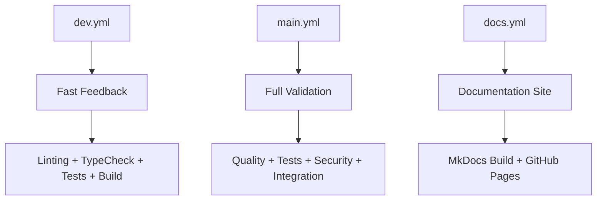

# GitHub Actions Workflows

This directory contains the CI/CD workflows for the Polyhegel project.

## Workflows

### `dev.yml` - Development Branch CI
- **Trigger**: Push to `dev` branch
- **Purpose**: Fast feedback for development
- **Jobs**:
  - `linting`: Code formatting and style checks
  - `typecheck`: MyPy type checking
  - `unit-tests`: Fast unit tests (no LLM calls)
  - `build-check`: Package build verification
  - `dev-summary`: Overall status summary

### `main.yml` - Main Branch CI
- **Trigger**: Push to `main` branch, releases
- **Purpose**: Comprehensive validation for production
- **Jobs**:
  - `quality-checks`: Linting and type checking
  - `unit-tests`: Full unit test suite with coverage
  - `integration-tests`: Integration tests with LLM APIs
  - `security-scan`: Security vulnerability scanning
  - `build-and-test`: Package build and installation testing

### `docs.yml` - Documentation Build
- **Trigger**: 
  - Manual dispatch (workflow_dispatch)
  - Push to docs/, mkdocs.yml, or Python files
- **Purpose**: Build and optionally deploy documentation
- **Jobs**:
  - `build-docs`: Generate documentation site with MkDocs
  - `test-docs`: Validate documentation structure
- **Features**:
  - Manual deployment option via GitHub UI
  - Automatic deployment on `main` branch
  - Artifact upload for review
  - Documentation structure validation

### `release.yml` - Release Management
- **Trigger**: 
  - Manual dispatch (workflow_dispatch) 
  - Published GitHub releases
- **Purpose**: Automated release creation and publishing
- **Jobs**:
  - `validate-release`: Version validation and testing
  - `create-github-release`: GitHub release creation with changelog
  - `build-and-publish`: Package building and asset upload
  - `deploy-docs`: Documentation deployment for release
  - `notify-completion`: Release summary and status
- **Features**:
  - Semantic version validation
  - Automatic changelog generation
  - Package building and verification
  - GitHub release asset upload
  - Documentation deployment
  - Pre-release support
  - PyPI publishing (when enabled)

## Manual Actions

### Build Documentation
1. Go to Actions tab in GitHub
2. Select "Build Documentation" workflow
3. Click "Run workflow"
4. Optionally check "Deploy to GitHub Pages" for immediate deployment

### Create Release
1. **Local version bump** (recommended):
   ```bash
   make release-minor  # or release-major, release-patch, release-prerelease
   git push origin main --tags
   ```

2. **Manual GitHub Release**:
   - Go to Actions tab in GitHub
   - Select "Release" workflow  
   - Click "Run workflow"
   - Enter version (e.g., "1.2.0")
   - Choose if it's a pre-release
   - Click "Run workflow"

### Trigger Integration Tests
Integration tests run automatically on `main` branch pushes, or can be triggered by:
1. Creating a pull request to `main`
2. Manual workflow dispatch (if enabled)

## Environment Variables

The workflows expect these secrets/variables:
- `OPENAI_API_KEY`: For integration tests
- `ANTHROPIC_API_KEY`: For integration tests  
- `LANGSMITH_API_KEY`: For integration tests (optional)
- `GITHUB_TOKEN`: Automatically provided for Pages deployment

## Workflow Dependencies

