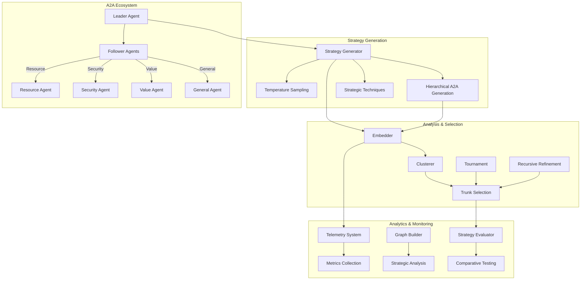

# Polyhegel

> **Simulator for identifying effective trunk narratives for swarm AI genesis**

[](https://python.org)
[](LICENSE)
[](https://allenday.github.io/polyhegel/)
[](tests/)

## Overview

Polyhegel is a sophisticated strategic simulation framework that uses AI-driven techniques to generate, analyze, and select optimal strategies through distributed agent coordination. It combines advanced machine learning with agent-to-agent (A2A) protocols to identify effective "trunk narratives" for complex strategic challenges.

## 🎯 Key Features

### **Strategic Simulation Engine**
- **Multi-temperature strategy generation** for diverse exploration of solution spaces
- **Advanced clustering techniques** to identify strategic patterns and relationships
- **Tournament-based selection** for optimal strategy identification
- **Recursive refinement** for continuous strategy optimization

### **A2A Agent Ecosystem**
- **Distributed agent architecture** with Leader/Follower coordination patterns
- **Specialized domain agents** for resource acquisition, security, and value creation
- **Real-time telemetry and monitoring** with comprehensive metrics collection
- **Secure authentication** with JWT-based agent communication

### **Advanced Analytics**
- **Graph-based strategy modeling** for relationship analysis
- **Comprehensive performance evaluation** with multiple strategic metrics
- **Comparative testing** and benchmarking capabilities
- **Strategic technique integration** with domain-specific methodologies

### **Enterprise Security**
- **TLS encryption** for secure data transmission
- **Role-based access control** and permissions management
- **Secure configuration** and credential management

## 🚀 Quick Start

### Installation

```bash
# Install from PyPI
pip install polyhegel

# Or install from source
git clone https://github.com/allenday/polyhegel.git
cd polyhegel
pip install -e .[dev]
```

### Basic Usage

```bash
# Run a strategic simulation
polyhegel simulate "Develop a market entry strategy for AI products"

# Start the A2A agent ecosystem
make agents-start

# Run tests
make test

# Build documentation
make docs
```

### Python API

```python
from polyhegel import PolyhegelSimulator
from polyhegel.models import StrategyChain

# Initialize simulator
simulator = PolyhegelSimulator()

# Run simulation
results = await simulator.run_simulation(
    temperature_counts=[(0.7, 5), (0.9, 3)],
    user_prompt="Develop a sustainable growth strategy",
    mode="temperature"
)

# Analyze results
for chain in results.strategy_chains:
    print(f"Strategy: {chain.strategy.title}")
    print(f"Score: {chain.strategy.alignment_score}")
```

## 📖 Documentation

- **[Full Documentation](https://allenday.github.io/polyhegel/)** - Complete guides and API reference
- **[Installation Guide](docs/getting-started/installation.md)** - Detailed setup instructions
- **[Quick Start Tutorial](docs/getting-started/quickstart.md)** - Your first simulation
- **[A2A Agents Guide](docs/guide/a2a-agents.md)** - Distributed agent coordination
- **[API Reference](docs/reference/)** - Detailed code documentation
- **[Development Guide](DEVELOPMENT.md)** - Contributing and development setup

## 🏗️ Architecture



## 🛠️ Core Components

| Component | Description |
|-----------|-------------|
| **Strategy Generator** | Multi-temperature AI-powered strategy generation |
| **A2A Agents** | Distributed leader/follower agent coordination |
| **Clusterer** | Advanced strategy clustering using HDBSCAN |
| **Tournament** | Selection mechanism for optimal strategies |
| **Recursive Refinement** | Iterative strategy optimization engine |
| **Telemetry System** | Comprehensive monitoring and metrics |
| **Strategic Techniques** | Domain-specific strategy methodologies |

## 🧪 Usage Examples

### Temperature-Based Generation
```python
# Generate strategies at different creativity levels
results = await simulator.run_simulation(
    temperature_counts=[
        (0.3, 2),  # Conservative strategies
        (0.7, 5),  # Balanced strategies  
        (1.0, 3),  # Creative strategies
    ],
    mode="temperature"
)
```

### A2A Distributed Generation
```python
from polyhegel.clients import PolyhegelA2AClient, A2AAgentEndpoints

# Configure A2A endpoints
endpoints = A2AAgentEndpoints.from_env()
client = PolyhegelA2AClient(endpoints)

# Generate hierarchical strategies
strategies = await client.generate_hierarchical_strategies(
    "Launch a new AI product in competitive market",
    max_themes=5
)
```

### Strategic Technique Integration
```python
from polyhegel import StrategyGenerator

generator = StrategyGenerator(model)

# Use specific strategic technique
strategies = await generator.generate_with_technique(
    strategic_challenge="Expand into new markets", 
    technique_name="blue_ocean_strategy",
    count=3
)
```

## 🔧 Development

See [DEVELOPMENT.md](DEVELOPMENT.md) for detailed development setup, testing guidelines, and contribution instructions.

### Quick Development Setup
```bash
# Clone and setup
git clone https://github.com/allenday/polyhegel.git
cd polyhegel
python -m venv .venv
source .venv/bin/activate  # or .venv\\Scripts\\activate on Windows
pip install -e .[dev]

# Run tests
make test

# Start development servers
make agents-start

# Format and lint
make format
make lint
```

## 📊 Testing

```bash
# Run all tests
make test-all

# Run specific test categories
make test-unit          # Fast unit tests
make test-integration   # Integration tests
make test-slow          # Comprehensive tests
make test-no-llm        # Tests without LLM calls

# Generate coverage report
make test-coverage
```

## 🤝 Contributing

We welcome contributions! Please see [DEVELOPMENT.md](DEVELOPMENT.md) for guidelines on:

- Setting up your development environment
- Running tests and quality checks
- Submitting pull requests
- Code style and standards

## 📄 License

This project is licensed under the MIT License - see the [LICENSE](LICENSE) file for details.

## 🙏 Acknowledgments

- Built with [pydantic-ai](https://github.com/pydantic/pydantic-ai) for AI model integration
- Uses [A2A SDK](https://github.com/PostFiatOrg/a2a-sdk) for agent coordination
- Documentation powered by [MkDocs Material](https://squidfunk.github.io/mkdocs-material/)

## 📞 Support

- 📚 [Documentation](https://allenday.github.io/polyhegel/)
- 🐛 [Issue Tracker](https://github.com/allenday/polyhegel/issues)
- 💬 [Discussions](https://github.com/allenday/polyhegel/discussions)
- 📧 [Contact](mailto:contact@postfiat.org)

---

**Polyhegel** - Empowering strategic decision-making through AI-driven simulation and distributed agent coordination.