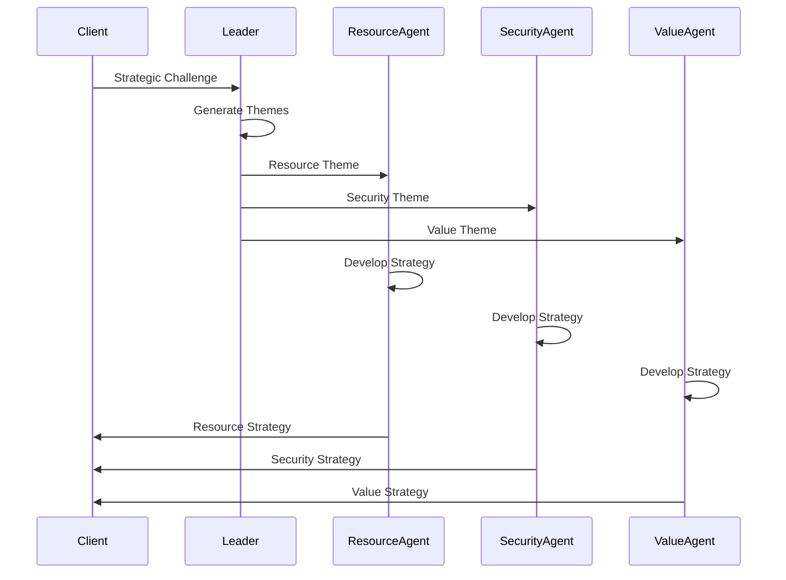

# Agent System Architecture

## A2A Protocol Integration

Polyhegel implements the Agent-to-Agent (A2A) protocol for distributed strategic planning. The system uses a hierarchical agent architecture with specialized roles.

## Agent Hierarchy

### Leader Agents
**Role**: Strategic theme generation and high-level planning

**Responsibilities**:
- Process strategic challenges into actionable themes
- Coordinate with follower agents for detailed development
- Maintain strategic coherence across distributed operations
- Generate themes with domain classification for proper routing

**Implementation**: `LeaderAgentExecutor` in `polyhegel.agents.a2a_executors`

```python
class LeaderAgentExecutor(AgentExecutor):
    async def execute(self, context: RequestContext, event_queue: EventQueue):
        # Generate strategic themes from user input
        # Create artifacts for downstream processing
        # Record telemetry for monitoring
```

### Follower Agents
**Role**: Detailed strategy implementation planning

**Specializations**:
- **Resource Agent**: Focus on resource acquisition and optimization
- **Security Agent**: Strategic security and risk management
- **Value Agent**: Value creation and catalysis strategies  
- **General Agent**: Fallback for unspecialized domains

**Implementation**: `FollowerAgentExecutor` with domain specialization

```python
class FollowerAgentExecutor(AgentExecutor):
    def __init__(self, model, specialization_domain=None):
        self.specialization_domain = specialization_domain
    
    async def execute(self, context: RequestContext, event_queue: EventQueue):
        # Develop detailed implementation strategies
        # Apply domain-specific expertise
        # Generate structured strategy artifacts
```

## Communication Flow



## Agent Configuration

### Endpoint Management
The `A2AAgentEndpoints` class manages agent discovery and communication:

```python
@dataclass
class A2AAgentEndpoints:
    leader_url: str = "http://localhost:8001"
    follower_resource_url: str = "http://localhost:8002"
    follower_security_url: str = "http://localhost:8003"
    follower_value_url: str = "http://localhost:8004" 
    follower_general_url: str = "http://localhost:8005"
```

### Authentication
Support for both API key and JWT token authentication:
- Environment variable configuration
- Per-agent credential management
- Automatic header generation for requests

## Error Handling and Resilience

### Fallback Mechanisms
- Agent unavailability detection via health checks
- Graceful degradation to mock responses
- Automatic retry with exponential backoff

### Monitoring Integration
- Request/response telemetry
- Performance metrics per agent
- Error rate tracking and alerting

## Deployment Patterns

### Local Development
All agents run on localhost with different ports for easy development and testing.

### Distributed Production
Agents deployed across multiple hosts/containers with service discovery:
- Load balancing for high availability
- Geographic distribution for performance
- Auto-scaling based on demand

### Hybrid Deployment
Mix of local and remote agents based on:
- Security requirements
- Performance characteristics
- Resource availability