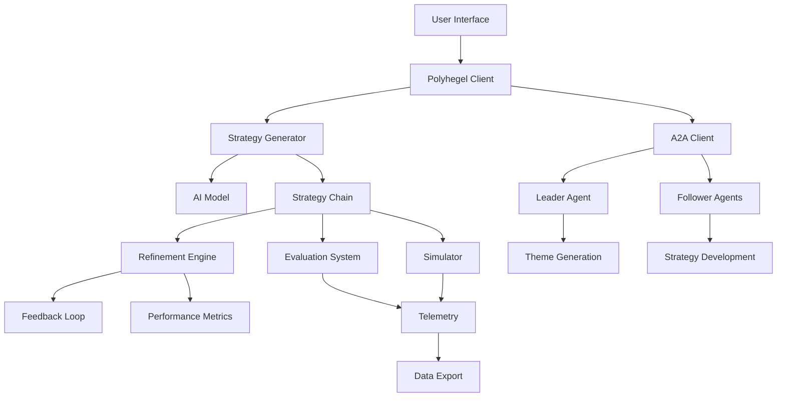

# Architecture Overview

## System Architecture

Polyhegel is a distributed strategic simulation framework that uses AI agents to generate, refine, and evaluate strategic solutions. The system is built on a modular architecture that supports both local execution and distributed A2A (Agent-to-Agent) communication.

## Core Components

### 1. Strategy Generation Layer
- **Strategy Generator**: Core component for generating strategies using temperature sampling
- **Strategic Techniques**: Domain-specific strategy patterns and approaches
- **Model Integration**: Interfaces with various AI models (Claude, GPT, etc.)

### 2. Agent System (A2A)
- **Leader Agents**: Generate strategic themes and high-level direction
- **Follower Agents**: Develop detailed implementation strategies
- **Domain Specialization**: Resource, security, value, and general purpose agents

### 3. Refinement Engine
- **Recursive Refinement**: Iterative strategy improvement through feedback loops  
- **Performance Tracking**: Metrics collection and analysis
- **Convergence Detection**: Automatic stopping conditions for optimization

### 4. Evaluation Framework
- **Strategic Metrics**: Multi-dimensional strategy assessment
- **Simulation Environment**: Controlled testing of strategic scenarios
- **Tournament Selection**: Competitive evaluation of strategy variants

### 5. Data Layer
- **Strategy Chains**: Immutable strategy representations with provenance
- **Telemetry System**: Comprehensive observability and monitoring
- **Export Systems**: Multiple format support for results and analysis

## Design Principles

### Modularity
Each component is designed as an independent module with well-defined interfaces, enabling:
- Easy testing and validation
- Component replacement and upgrades
- Distributed deployment flexibility

### Observability
Comprehensive telemetry throughout all operations:
- Performance metrics collection
- Event tracking and correlation
- Error monitoring and debugging support

### Scalability
Architecture supports scaling from single-user to enterprise deployment:
- Distributed agent coordination
- Concurrent strategy generation
- Resource-aware execution limits

### Extensibility
Plugin-based architecture for:
- Custom strategic techniques
- New AI model integrations
- Domain-specific evaluation criteria