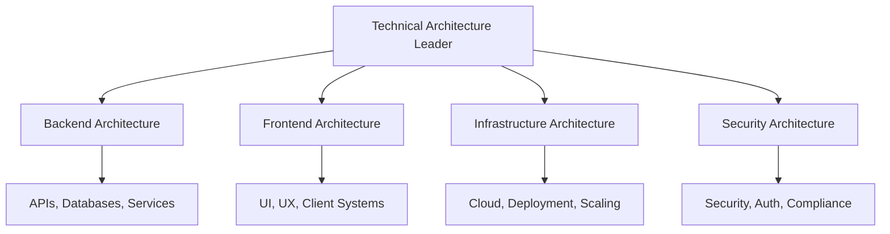

# Technical Architecture Planning Domain

## Overview

The Technical Architecture Planning Domain is a specialized multi-agent system within Polyhegel that provides comprehensive technical architecture analysis, design, and evaluation capabilities. It extends the existing strategic planning framework with domain-specific expertise in technical system design.

## Architecture

### Domain Structure

The technical architecture domain is organized into four specialized sub-domains:



### Agent Hierarchy

#### Technical Architecture Leader Agent
- **Role**: High-level architecture analysis and pattern recommendation
- **Port**: 9001 (default)
- **Capabilities**:
  - Requirements analysis and architecture pattern generation
  - Technology stack evaluation and trade-off analysis
  - Multi-domain architecture coordination
  - Quality attribute assessment

#### Technical Architecture Follower Agents

**Backend Architecture Agent (Port 9002)**
- Server-side systems and API design
- Database architecture and data modeling
- Microservices vs monolithic patterns
- Event-driven architecture patterns

**Frontend Architecture Agent (Port 9003)**
- User interface and experience design
- Client-side architecture patterns
- State management and component design
- Progressive Web App (PWA) strategies

**Infrastructure Architecture Agent (Port 9004)**
- Cloud platform and deployment strategies
- Container orchestration and scaling
- Infrastructure as Code (IaC) implementation
- Multi-region and disaster recovery

**Security Architecture Agent (Port 9005)**
- Security patterns and threat modeling
- Authentication and authorization systems
- Encryption and compliance strategies
- Zero Trust architecture implementation

## Technical Architecture Techniques

### Backend Architecture Techniques

#### Microservices Architecture
- **Complexity**: High
- **Scalability Impact**: High
- **Use Cases**: Large-scale applications, independent team deployments
- **Trade-offs**: Increased operational complexity vs independent deployments

#### Event-Driven Architecture
- **Complexity**: Medium
- **Scalability Impact**: High
- **Use Cases**: Real-time data processing, decoupled system integration
- **Trade-offs**: Loose coupling vs eventual consistency

#### API Gateway Pattern
- **Complexity**: Medium
- **Scalability Impact**: Medium
- **Use Cases**: Microservices management, cross-cutting concerns
- **Trade-offs**: Single point of failure vs centralized management

### Frontend Architecture Techniques

#### Component-Based Architecture
- **Complexity**: Medium
- **Scalability Impact**: Medium
- **Use Cases**: Large-scale web applications, design systems
- **Trade-offs**: Initial setup complexity vs long-term maintainability

#### Micro-Frontend Architecture
- **Complexity**: High
- **Scalability Impact**: High
- **Use Cases**: Multiple frontend teams, technology diversity
- **Trade-offs**: Team autonomy vs user experience consistency

#### Progressive Web App (PWA)
- **Complexity**: Medium
- **Scalability Impact**: Low
- **Use Cases**: Mobile-first applications, offline capabilities
- **Trade-offs**: Development complexity vs native app capabilities

### Infrastructure Architecture Techniques

#### Container Orchestration
- **Complexity**: High
- **Scalability Impact**: High
- **Use Cases**: Microservices deployment, resource optimization
- **Trade-offs**: Operational complexity vs deployment flexibility

#### Infrastructure as Code (IaC)
- **Complexity**: Medium
- **Scalability Impact**: Medium
- **Use Cases**: Reproducible deployments, version control
- **Trade-offs**: Initial setup time vs long-term maintainability

#### Auto-Scaling Architecture
- **Complexity**: Medium
- **Scalability Impact**: High
- **Use Cases**: Variable traffic, cost optimization
- **Trade-offs**: Scaling latency vs resource efficiency

### Security Architecture Techniques

#### Zero Trust Architecture
- **Complexity**: High
- **Scalability Impact**: Medium
- **Use Cases**: Remote work, cloud-native security
- **Trade-offs**: Security rigor vs user experience

#### OAuth 2.0 / OpenID Connect
- **Complexity**: Medium
- **Scalability Impact**: Low
- **Use Cases**: Third-party integration, SSO implementations
- **Trade-offs**: Protocol complexity vs security standardization

#### API Security Gateway
- **Complexity**: Medium
- **Scalability Impact**: Medium
- **Use Cases**: Microservices security, centralized policy management
- **Trade-offs**: Central control vs distributed security

## Evaluation Metrics

### Quality Attributes
- **Scalability**: Ability to handle increased load (1-5 scale)
- **Performance**: System responsiveness and throughput (1-5 scale)
- **Reliability**: Availability and fault tolerance (1-5 scale)
- **Security**: Threat protection and compliance (1-5 scale)
- **Maintainability**: Ease of modification and extension (1-5 scale)
- **Usability**: User experience quality (1-5 scale)

### Technical Excellence
- **Architecture Pattern Appropriateness**: Pattern suitability (1-5 scale)
- **Technology Stack Quality**: Technology choices maturity (1-5 scale)
- **Code Quality**: Implementation structure and documentation (1-5 scale)
- **API Design Quality**: API consistency and documentation (1-5 scale)
- **Data Architecture Quality**: Data modeling and access patterns (1-5 scale)

### Implementation Feasibility
- **Implementation Complexity**: Development difficulty (1-5 scale, 1=complex)
- **Development Time Estimate**: Implementation effort (person-months)
- **Team Skill Requirements**: Required expertise level (1-5 scale, 1=expert)
- **Infrastructure Cost**: Monthly operational costs (USD)
- **Third-party Dependencies**: Number of critical dependencies

### Business Alignment
- **Requirements Coverage**: Functional requirements addressed (0-100%)
- **Business Value Delivery**: Value creation enablement (1-5 scale)
- **Time to Market**: Delivery speed capability (1-5 scale)
- **Future Adaptability**: Flexibility for changing requirements (1-5 scale)

## Usage Examples

### Starting Technical Architecture Agents

#### Leader Agent
```bash
# Start the technical architecture leader agent
./scripts/run-techarch-leader.sh

# Custom configuration
export POLYHEGEL_TECHARCH_LEADER_PORT=9001
export POLYHEGEL_TECHARCH_COMPLEXITY_TOLERANCE=high
./scripts/run-techarch-leader.sh
```

#### Follower Agents
```bash
# Start all specialized follower agents
./scripts/run-techarch-follower-backend.sh      # Port 9002
./scripts/run-techarch-follower-frontend.sh     # Port 9003
./scripts/run-techarch-follower-infrastructure.sh # Port 9004
./scripts/run-techarch-follower-security.sh     # Port 9005
```

### API Usage Examples

#### Architecture Analysis Request
```json
{
  "challenge": "Design a scalable e-commerce platform that handles 10M+ users",
  "requirements": {
    "scalability": "high",
    "complexity_tolerance": "medium",
    "domains": ["backend_architecture", "frontend_architecture", "infrastructure_architecture"]
  }
}
```

#### Expected Response
```json
{
  "architecture_patterns": [
    {
      "name": "Distributed Microservices Architecture",
      "description": "Highly scalable distributed system with independent services",
      "domains": ["backend_architecture", "infrastructure_architecture"],
      "justification": "High scalability requirements necessitate distributed architecture"
    }
  ],
  "domain_recommendations": {
    "backend_architecture": [
      {
        "name": "Microservices Architecture",
        "complexity": "high",
        "scalability_impact": "high",
        "trade_offs": ["Increased operational complexity vs independent deployments"]
      }
    ]
  }
}
```

### Integration with Strategic Planning

The technical architecture domain integrates seamlessly with the existing strategic planning system:

```python
from polyhegel.technical_architecture import analyze_architecture_requirements
from polyhegel.agents.technical_architecture_executors import TechnicalArchitectureLeaderExecutor

# Analyze technical requirements
requirements = {
    "scalability": "high",
    "complexity_tolerance": "medium"
}

recommendations = analyze_architecture_requirements(requirements)
```

### Evaluation Usage

```python
from polyhegel.evaluation.technical_architecture_metrics import (
    TechnicalArchitectureEvaluator,
    TechnicalArchitectureDomain
)

# Create evaluator for backend architecture
evaluator = TechnicalArchitectureEvaluator(TechnicalArchitectureDomain.BACKEND_ARCHITECTURE)

# Get relevant metrics
metrics = evaluator.get_relevant_metrics(
    category=MetricCategory.QUALITY_ATTRIBUTES
)

# Calculate scores from evaluations
overall_score = evaluator.calculate_weighted_score(evaluations)
```

## Configuration

### Environment Variables

#### Leader Agent
- `POLYHEGEL_TECHARCH_LEADER_HOST`: Server host (default: 0.0.0.0)
- `POLYHEGEL_TECHARCH_LEADER_PORT`: Server port (default: 9001)  
- `POLYHEGEL_TECHARCH_LEADER_MODEL`: AI model (default: claude-3-haiku-20240307)
- `POLYHEGEL_TECHARCH_COMPLEXITY_TOLERANCE`: Complexity tolerance (default: medium)

#### Follower Agents
- `POLYHEGEL_TECHARCH_FOLLOWER_HOST`: Server host (default: 0.0.0.0)
- `POLYHEGEL_TECHARCH_FOLLOWER_PORT`: Server port (varies by specialization)
- `POLYHEGEL_TECHARCH_FOLLOWER_MODEL`: AI model (default: claude-3-haiku-20240307)
- `POLYHEGEL_TECHARCH_SPECIALIZATION_DOMAIN`: Domain specialization

### Agent Cards

The technical architecture agents register with the A2A system using specialized agent cards that advertise their capabilities:

```python
from polyhegel.agents.technical_architecture_cards import (
    create_all_technical_architecture_agent_cards
)

# Create all agent cards
agent_cards = create_all_technical_architecture_agent_cards()
```

## Integration Points

### Multi-Domain Orchestrator
The technical architecture domain integrates with the multi-domain orchestration system through:
- Standardized A2A protocol interfaces
- Compatible agent card specifications
- Shared telemetry and monitoring systems
- Common authentication and authorization mechanisms

### Template Framework
Technical architecture reasoning templates provide structured approaches to:
- Architecture pattern analysis
- Technology evaluation
- Trade-off assessment
- Solution comparison

### A2A Context Sharing
Enhanced context sharing enables:
- Cross-domain architecture coordination
- Knowledge transfer between specialized agents
- Consistent architecture decisions across domains

## Testing

Comprehensive test coverage includes:
- Domain and technique definitions
- Agent executor functionality
- Evaluation metrics accuracy
- Integration with existing systems
- End-to-end architecture workflows

Run tests with:
```bash
pytest tests/test_technical_architecture.py -v
```

## Future Enhancements

### Planned Features
- **Cost Optimization Agent**: Specialized agent for architecture cost analysis
- **Performance Analysis Agent**: Deep performance modeling and prediction
- **Migration Planning Agent**: Legacy system modernization strategies
- **Compliance Agent**: Regulatory and compliance-focused architecture patterns

### Integration Opportunities
- Integration with cloud provider APIs for real-time cost analysis
- Connection to performance monitoring systems for validation
- Integration with security scanning tools for automated assessment
- Link with deployment pipeline systems for implementation tracking

## Conclusion

The Technical Architecture Planning Domain extends Polyhegel's strategic planning capabilities into the technical realm, providing comprehensive architecture analysis, design, and evaluation tools. Through its multi-agent architecture and domain-specific expertise, it enables organizations to make informed technical architecture decisions that align with business objectives while maintaining high standards of quality, scalability, and maintainability.