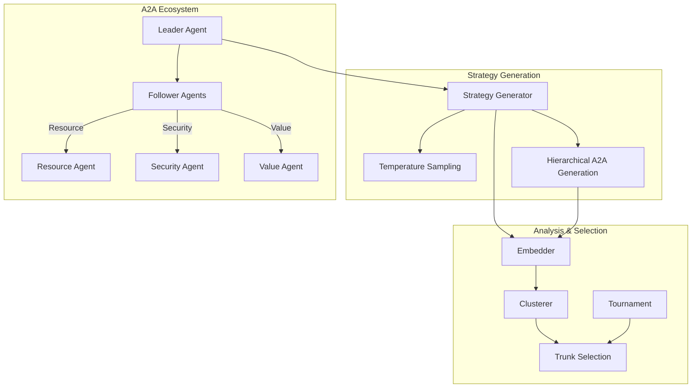

# Polyhegel Documentation

Welcome to **Polyhegel** - a simulator for identifying effective trunk narratives for swarm AI genesis.

## What is Polyhegel?

Polyhegel is a sophisticated strategic simulation framework that uses AI-driven techniques to:

- **Generate diverse strategic approaches** using temperature-based sampling
- **Identify optimal "trunk" strategies** through clustering and tournament selection
- **Support A2A (Agent-to-Agent) coordination** for distributed strategic planning
- **Provide comprehensive evaluation** of strategic effectiveness

## Key Features

### 🎯 **Strategic Simulation**
- Multi-temperature strategy generation for diverse exploration
- Advanced clustering techniques to identify strategic patterns
- Tournament-based selection for optimal strategy identification

### 🤖 **A2A Agent Ecosystem**
- Distributed agent architecture with Leader/Follower patterns
- Secure authentication and authorization system
- Real-time telemetry and monitoring

### 🔬 **Advanced Analytics**
- Comprehensive metrics collection and analysis
- Graph-based strategy relationship modeling
- Performance evaluation and comparison tools

### 🛡️ **Enterprise Security**
- JWT-based authentication for agent communication
- TLS encryption for secure data transmission
- Role-based access control and permissions

## Quick Start

Get started with Polyhegel in just a few commands:

```bash
# Install Polyhegel
pip install polyhegel

# Run a basic simulation
polyhegel simulate "Develop a market entry strategy for AI products"

# Start A2A agent ecosystem
make agents-start
```

## Architecture Overview



## Next Steps

- [Installation Guide](getting-started/installation.md) - Get Polyhegel set up
- [Quick Start Tutorial](getting-started/quickstart.md) - Your first simulation
- [A2A Agents Guide](guide/a2a-agents.md) - Learn about distributed agents
- [API Reference](reference/) - Detailed code documentation

## Contributing

Polyhegel is open source and welcomes contributions! See our [Development Guide](contributing/development.md) for how to get started.

## Support

- 📚 [Documentation](https://allenday.github.io/polyhegel/)
- 🐛 [Issue Tracker](https://github.com/allenday/polyhegel/issues)  
- 💬 [Discussions](https://github.com/allenday/polyhegel/discussions)